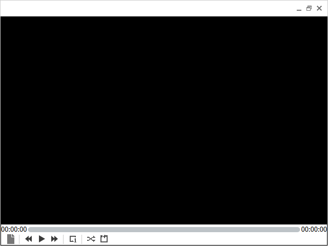
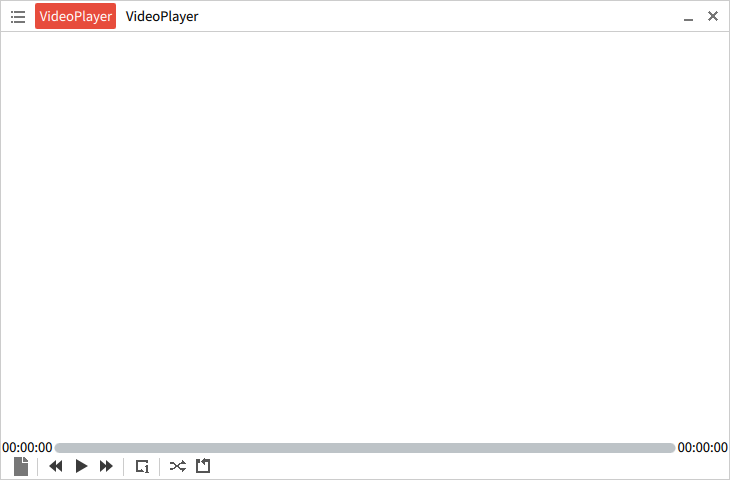
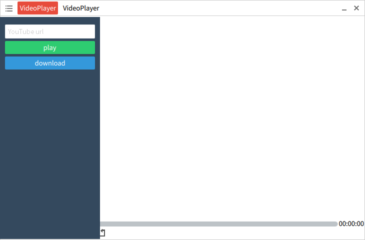

# Flat.qml

FlatUI by `QtQuick.Controls` 1.x.

参考 FlatUI 设计的一套 QtQuick 控件

## ButtonStyle

## GroupBox

## SampleVideoPlayer

## new demo

### YouTuBe

> [FlatUI](https://github.com/designmodo/Flat-UI)

> [Qt](http://www.qt.io/)

> [blog](http://blog.csdn.net/qyvlik)

